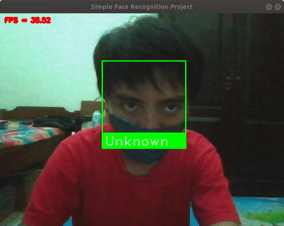

# Simple Face Recognition Project
Simple Face Recognition Implementation in Python and C++

## Python

The face recognition system implemented in Python within the GUI. You can capture an image or record a video during the video stream live from webcam. Source code available [here](https://github.com/reshalfahsi/simple-face-recognition-project/tree/master/python).

### Features

* Stream Video: Stream live video from the webcam.
* Select Webcam: Select the available webcam in your hardware. The available webcam updated periodically.
* Capture Image: Capture an image from the streaming video.
* Video Recorder: Record a video at some point of the streaming video.
* Select Dataset: Select the proper dataset for the face recognition system. 

## C++

The face recognition system implemented in C++. It received a video stream from the webcam. Then, the result is shown in the window GUI.

