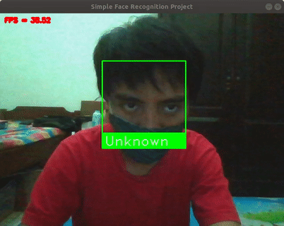

# Simple Face Recognition Project in C++

The face recognition system implemented in C++. It received a video stream from the webcam. Then, the result is shown in the window GUI.



## Dependencies

* GCC 7
* OpenCV 4.2.0 build with opencv_contrib module
* Ubuntu OS
* Python 3.++

```shell
$ sudo pip3 install -r requirements.txt --no-cache-dir
```

## Installation

```shell
$ git clone 
$ https://github.com/reshalfahsi/simple-face-recognition-project
$ cd simple-face-recognition-project/cpp
$ mkdir -p build
$ cd build
$ conan install ..
$ conan build ..
```

## Run the Program

After the installation and still under the same folder, run the following command.

```shell
$ ./FaceRecognition --camera /dev/video0 --weight /path/to/weight --config /path/to/config --recog /path/to/recog --dataset /path/to/dataset
```

* `--camera` flag determines which camera device that will be used as video streaming.
* `--weight` or `-w` flag determines the path to the weight file for the face detection network.
* `--config` flag determines the path to the configuration file for the face detection network.
* `--recog` flag determines the path to the weight file for the face recognition network.
* `--dataset` flag determines the path to the dataset that will be used for the face recognition system. The dataset is structured as below.

```
dataset
├──Name_01.jpg
├──Name_02.jpg
├──Name_03.jpg
.
.
.
└──Name_N.jpg
```

The weight and configuration files could be downloaded [here](https://drive.google.com/file/d/1YAPqRqTzLP6QLM-U59QzW_Sh_d5g9Zag/view).
