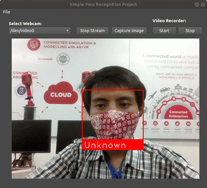

# Simple Face Recognition Project in Python

The face recognition system implemented in Python within the GUI. The GUI is equipped with various features. You can capture an image or record a video during the video stream live from the webcam.



## Dependencies

* Ubuntu OS
* Python 3.++

```shell
$ sudo apt install pyqt5-dev-tools
$ sudo pip3 install -r requirements.txt --no-cache-dir
```

## Installation

```shell
$ git clone 
$ https://github.com/reshalfahsi/simple-face-recognition-project
$ cd simple-face-recognition-project/python
$ python3 app.py
```

## Features

* Stream Video: Stream live video from the webcam. You can start or stop the streaming anytime.
* Select Webcam: Select the available webcam in your hardware. The available webcam updated periodically.
* Capture Image: Capture an image from the streaming video. Then, the image is saved in a certain directory.
* Video Recorder: Record a video at some point on the streaming video. Then, the video is saved in a certain directory.
* Select Dataset: Select the proper dataset for the face recognition system. The dataset is structured as below.

```
dataset
├──Name_01.jpg
├──Name_02.jpg
├──Name_03.jpg
.
.
.
└──Name_N.jpg
```
